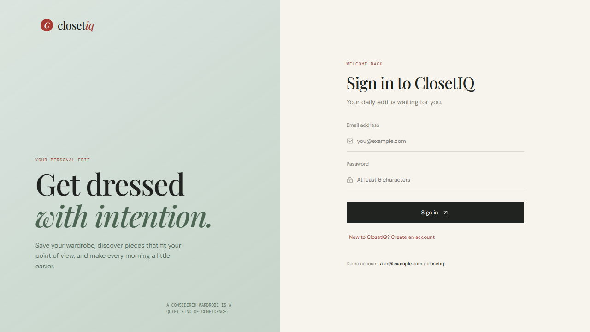
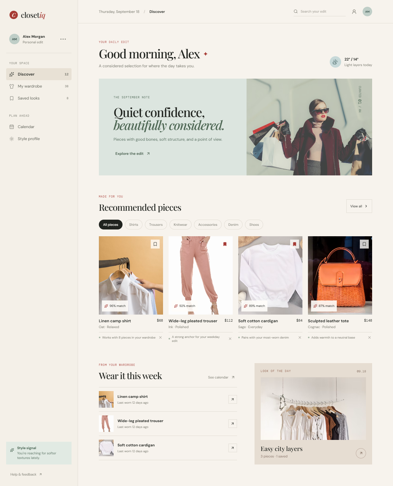

# ClosetIQ

ClosetIQ is a fashion recommendation dashboard with a Vite frontend and a small Node API backed by a JSON store.

## Live Application

Open the deployed frontend:

https://closetiq-fashion-recommendation-system-1.onrender.com/

## Screenshots

### Login



### Recommendation dashboard



## Run locally

Install dependencies:

```bash
npm install
```

Start the API in one terminal:

```bash
npm run api
```

Start the frontend in a second terminal:

```bash
npm run dev
```

Open `http://127.0.0.1:5173/`.

## API

- `GET /api/health` checks service availability.
- `POST /api/auth/register` creates an account and returns a session token.
- `POST /api/auth/login` signs in with email and password.
- `GET /api/auth/me` returns the active session user.
- `POST /api/auth/logout` invalidates the active session.
- `PATCH /api/profile` updates the signed-in user's name and style signal.
- `GET /api/bootstrap` loads the profile, catalog, wardrobe, and saved items.
- `GET /api/products?q=&category=` filters catalog items.
- `POST /api/saved` toggles a saved product with `{ "productId": 1 }`.
- `POST /api/feedback` records a recommendation dismissal with `{ "productId": 1, "action": "dismiss" }`.

Persistent demo state lives in `server/store.json` and can be replaced by a database when authentication and multi-user storage are introduced.

The seeded demo account is `alex@example.com` with password `closetiq`.

## Deploy With Render

Deploy the API first, then the frontend.

### 1. Deploy the API

Create a Render **Web Service** connected to this repository:

- Build command: `npm install`
- Start command: `npm run api`
- Environment: `Node`

Render provides the `PORT` environment variable automatically. After deploy, confirm `https://YOUR-API.onrender.com/api/health` returns `{ "status": "ok" }`.

### 2. Deploy the frontend

Create a Render **Static Site** from the same repository:

- Build command: `npm install && npm run build`
- Publish directory: `dist`
- Environment variable: `VITE_API_URL=https://YOUR-API.onrender.com`

The variable must be set before the frontend build because Vite embeds it into the generated assets. Redeploy the static site after changing it.

### 3. Verify the deployed app

Open the live app at https://closetiq-fashion-recommendation-system-1.onrender.com/, register or use the demo account, then verify login, profile editing, saving items, and logout. Keep the API service running while using the frontend.

The deployed API health endpoint is `https://closetiq-api.onrender.com/api/health` when using the current Render service name.

The current JSON store is suitable for a demo deployment. Render's local filesystem is not durable across all service restarts, so use a managed database or persistent disk before treating this as production user data.

For Vercel, deploy the frontend as a Vite project with build command `npm run build`, output directory `dist`, and the same `VITE_API_URL` environment variable. Deploy the API separately on Render or another Node host.
